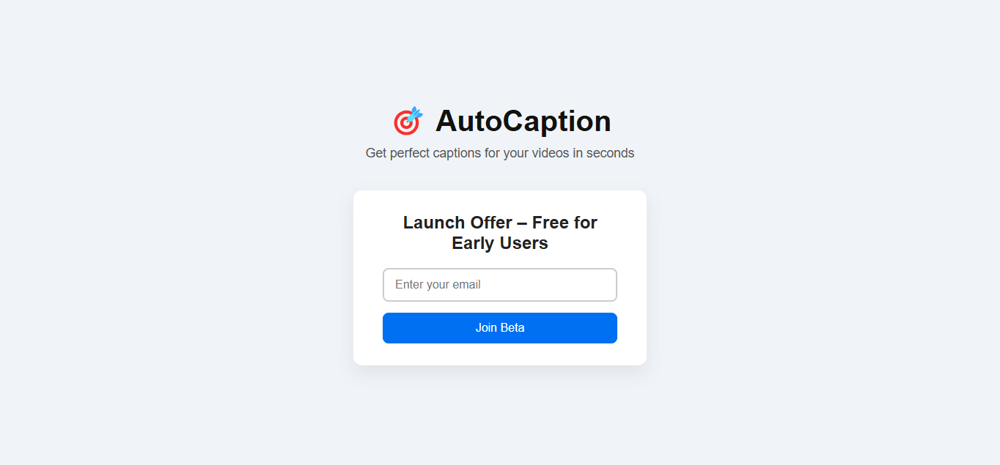

# AutoCaption – Micro-SaaS Lead Magnet

🎯 **AutoCaption** is a minimal teaser landing page for an AI video caption service. It allows early users to join a beta list by submitting their email.  

---

## Project Overview

- **Purpose:** Collect emails for early access to AutoCaption.  
- **Tech Stack:** HTML + CSS  
- **Features:**  
  - Minimal and modern design  
  - Responsive layout  
  - Clean opt-in form connected to FormSubmit  

---

## Live Preview

Here’s a screenshot of the landing page:



---

## Installation / Usage

1. Clone or download the repository.  
2. Open `index.html` in your browser.  
3. Edit the form action URL in `index.html` with your email:  
```html
